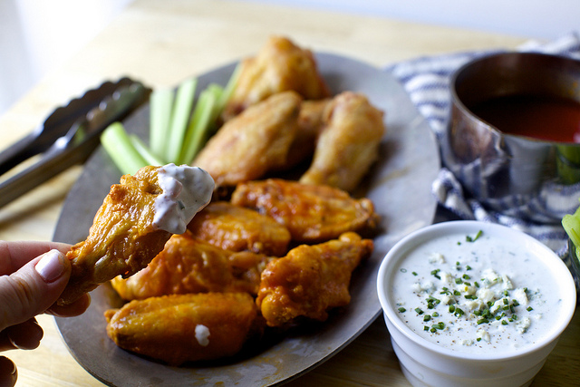

```{r setup, include=FALSE}
knitr::opts_chunk$set(echo = TRUE)

```

##Star Wars
###Name£º
Anakin Skywalker

###Famous Quote:
"I'm not the jedi I should be."

```{r pressure, echo=FALSE, fig.cap="", out.width = '30%'}

```

Catagory | Value
--------|--------
Species | Human
Gender | Male
Eye color | Blue 
Skin color | Fair 


##Baked Buffalo Wings--Recipe
```{r  echo=FALSE, fig.cap="", out.width = '50%'}

```

###Ingredients:
* 1 to 4 pounds chicken wings that have been cut into flats and drumettes
* 1 1/2 teaspoons to 2 tablespoons baking powder (using 1 1/2 teaspoons per pound)
* 1 to 4 teaspoons kosher salt (using 1 teaspoon per pound; use less salt if you¡¯re not using Diamond brand)
* 2 tablespoons hot sauce (Frank¡¯s RedHot is traditional) per pound of wings
* 1 1/2 to 2 tablespoons unsalted butter per pound of wings
* To serve (optional): Homemade Blue Cheese Dressing (below), plus celery and carrot sticks

###Special kichen tools
* oven
* paper towel

###Steps
* Line a large baking sheet with foil and set an oven-safe cooling rack on top.
* Pat wings dry with a paper towel, and then, in a large bowl, toss them with 1 1/2 teaspoons baking powder and 1 teaspoon kosher salt per pound of wings, until thoroughly coated.
* Arrange them on the rack with some space between them (the surface will not dry and crisp as well where they touch) and place in your refrigerator uncovered for 8 to 24 hours.
* When you¡¯re ready to bake them, heat your oven to 450 degrees, with a rack set in the top half of your oven.
* Bake your wings for 20 minutes, flip them with tongs or a spatula, bake them for another 15 minutes, flip them back over again, and then for 15 final minutes, for a total roasting time of 50 minutes. You might need up to 5 minutes longer for larger wings. Wings are done with they are browned and crisp.
* While the wings roast, make Buffalo wing sauce. 
* In a medium saucepan, for each pound of wings, combine 2 tablespoons of hot sauce and 1 1/2 tablespoons (for a hotter sauce) to 2 tablespoons (for a mild, more buttery sauce) unsalted butter over medium heat until melted, whisking to combine. 
* Set aside. Make Blue Cheese Dressing, if you wish (recipe below) and prepare carrots and celery.
* When wings are done, roll each in prepared Buffalo wing sauce. Serve with fixings of your choice.

###Previously
####For the other side of the world:
Six Months Ago: Minimalist Barbecue Sauce\
1.5 Years Ago: German Chocolate Cake + A Wedding Cake\
2.5 Years Ago: Blackberry Cheesecake Galette and Eggplant with Yogurt and Tomato Relish\
3.5 Years Ago: Tomato and Fried Provolone Sandwich\
4.5 Years Ago: Grilled Peach Splits and Summer Squash Gratin with Salsa Verde


##Euclidean distance
In mathematics, the **Euclidean distance** or Euclidean metric is the "ordinary" straight-line distance between two points in Euclidean space. With this distance, Euclidean space becomes a metric space. The associated norm is called the Euclidean norm. Older literature refers to the metric as the Pythagorean metric. A generalized term for the Euclidean norm is the L2 norm or L2 distance.

###Definition

The **Euclidean distance** between points **p** and **q** is the length of the line segment connecting them (**pq**)\
In Cartesian coordinates, if **p** = (*p1, p2,..., pn*) and **q** = (*q1, q2,..., qn*) are two points in Euclidean n-space, then the distance (d) from **p** to **q**, or from **q** to **p** is given by the Pythagorean formula:\
\begin{align*}
d(p,q) = d(q,p) =
\sqrt{(q_1-p_1)^2+(q_2-p_2)^2\dots+(q_n-p_n)^2} = 
\sqrt{\sum_{i=1}^{n}((q_n-p_n)^2)}
\end{align*}

The position of a point in a Euclidean n-space is a Euclidean vector. So, p and q may be represented as Euclidean vectors, starting from the origin of the space (initial point) with their tips (terminal points) ending at the two points. The Euclidean norm, or Euclidean length, or magnitude of a vector measures the length of the vector:\
\begin{align*}
||p|| = \sqrt{p_1^2+p_2^2+\dots+p_n^2}
= \sqrt{p\times p}
\end{align*}

where the last expression involves the dot product.\

Describing a vector as a directed line segment from the origin of the Euclidean space (vector tail), to a point in that space (vector tip), its length is actually the distance from its tail to its tip. The Euclidean norm of a vector is seen to be just the Euclidean distance between its tail and its tip.\

The relationship between points **p** and **q** may involve a direction (for example, from **p** to **q**), so when it does, this relationship can itself be represented by a vector, given by\

\begin{align*}
q - p = (q_1-p_1,q_2-p_2,\dots ,q_n-p_n)
\end{align*}

In a two- or three-dimensional space (n = 2, 3), this can be visually represented as an arrow from p to q. In any space it can be regarded as the position of **q** relative to **p**. It may also be called a displacement vector if **p** and **q** represent two positions of some moving point.\

The Euclidean distance between **p** and **q** is just the Euclidean length of this displacement vector:\

\begin{align*}
||q - p|| = = \sqrt{(q - p)\times (q - p)}
\end{align*}

which is equivalent to equation 1, and also to:\

\begin{align*}
||q - p|| = = \sqrt{||p||^2+||q||^2-2p\times q}
\end{align*}
