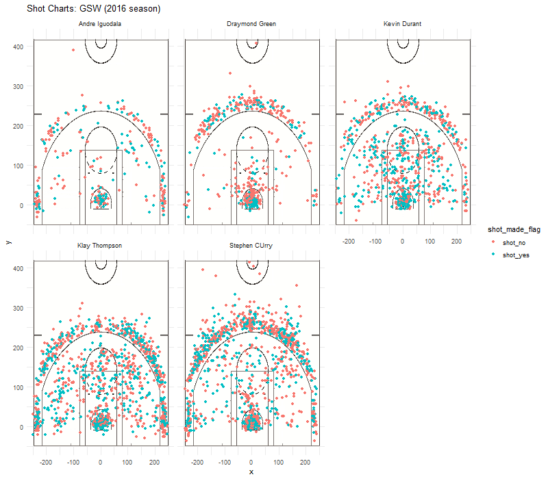

###**Introduction**
When it comes to **the best shooter** of Golden State Warriors, are you automatically thinking of ***Stephen Curry***? Yes, he is a brilliant shooter, considering the amount of time he controls the ball and the number of times he takes the shots, but is that really the case? If not, you are probably not a Golden State Warrior fan like me and Stephen Curry is probably the only member you have ever heard of, then you are forgiven. But if you do know other members, when you think carefully, just because he throws more often and he is actually really handsome (if you don¡¯t know him, I will show you the picture, he does look good), doesn¡¯t make him the best shooter in the whole team. If you still can¡¯t believe he is not as perfect as you think, I¡¯m here to show you the evidence.

Before I show you the magic, I would like to give you a little background of this cute guy. And here¡¯s the picture I promised.\


```{r echo=FALSE, tidy=TRUE}
library(knitr)
library(dplyr)
```

```{r echo=FALSE}
knitr::include_graphics("../images/Stephen_Curry_Shooting.jpg")
```

*In 2014¨C15, Curry won his first MVP award and led the Warriors to their first championship since 1975. The following season, he became the first player in NBA history to be elected MVP by a unanimous vote and to lead the league in scoring while shooting above 50¨C40¨C90. That same year, the Warriors broke the record for the most wins in an NBA season en route to reaching the 2016 NBA Finals, which they lost to the Cleveland Cavaliers. Curry helped the Warriors return to the NBA Finals in 2017 and 2018, where they won back-to-back titles.* (ref:<https://en.wikipedia.org/wiki/Stephen_Curry>)

###Purpose

Briefly, this report uses the data of all the games in the NBA 2016 season Golden State Warriors played, to analyze and conclude the best shooter of the team.

###Data

First, let¡¯s look at these three cute tables I made. Please ignore the ones you don¡¯t understand in English (neither do I, I am joking) and the typo there intentionally to draw your attention to Curry. I picked 5 main players in the Golden State Warriors(excatly as what professor offered), and presented the total shots (as ¡°total¡± in the tables), the shots this player made (as ¡°made¡± in the tables), and the percentage of made shots over total shots, which you can consider as the accuracy or efficiency of the shots this player made. As you can clearly see in the table, and I¡¯m not faking the number by the way, that no matter how we classify the shots, poor little Curry is never the first, he did made the most shots though. 

#####2PT shooter
```{r echo=FALSE}
bind_players <- read.csv("../data/shots-data.csv", stringsAsFactors = FALSE)

twopointers = filter(bind_players, bind_players$shot_type == "2PT Field Goal")
twopointers[twopointers$shot_type=="2PT Field Goal",] %>%
  group_by(name) %>%
  summarise(total = n(),
            made = sum(shot_made_flag=="shot_yes")) %>%
  mutate(perc_made = made/total) %>%
  arrange(desc(perc_made))
```
#####3 PT shooter
```{r echo=FALSE}
threepointers = filter(bind_players, bind_players$shot_type == "3PT Field Goal")
threepointers[threepointers$shot_type=="3PT Field Goal",] %>%
  group_by(name) %>%
  summarise(total = n(),
            made = sum(shot_made_flag=="shot_yes")) %>%
  mutate(perc_made = made/total) %>%
  arrange(desc(perc_made))
```
#####All PT shooter
```{r echo=FALSE}
allpointers = bind_players %>%
  group_by(name) %>%
  summarise(total = n(),
            made = sum(shot_made_flag=="shot_yes")) %>%
  mutate(perc_made = made/total) %>%
  arrange(desc(perc_made))
allpointers
```

Let¡¯s analyze it along with the charts I made. (Don¡¯t make fun of it if you think it¡¯s ugly, I am serious. Compliments accepted.) 


As it could be seen in the charts, I faceted the charts into different players, with which we could get a better impression of the results. The blue dots represent the ¡°made¡± shots (a.k.a the shots that got points), while the red ones represent the shots that fail to get points(nice try!). The more dense the dots are, means the more shots this player made during the season. And you could get the number with the tables I listed above. (The reason why I show you the charts later is that it¡¯s too charming that you wouldn¡¯t give a glimpse of my tables if I show you this first, and the tables are more accurate.) 


```{r echo=FALSE}


```


###Analysis

####Who is the best 2PT shooter?

Here comes the most difficult question. Let¡¯s look at the charts.


As I mentioned before, the color represents the efficiency, and the density of the dots represents the number of shots. The 2PT shots are the dots within the three point line(don¡¯t ask me what is that), we could get a rough idea of the number and the efficiency of the shots made by this player. Looks like it could be either Durant or Thompson who made the most 2PT shots, and Durant seems more efficient.

Who exactly is the best 2PT shooter? Let¡¯s go back to the first table. 


#####2PT shooter
```{r echo=FALSE}
twopointers[twopointers$shot_type=="2PT Field Goal",] %>%
  group_by(name) %>%
  summarise(total = n(),
            made = sum(shot_made_flag=="shot_yes")) %>%
  mutate(perc_made = made/total) %>%
  arrange(desc(perc_made))
```
In theory, the player got the most efficient 2 PT shots is Andre Iguodala, although he only made 210 shots in total, which is 37.3% of what Curry made (no offence). But we cannot just focus on the efficiency that this player made, what if he only made one out of one which is 100%? So let¡¯s look at the second player on the list (drum roll......)--KEVIN DURANT!!! He is perfect regarding the 2PT shots, giving the fact that he made the most 2PT shots as well as the second highest efficiency. Compared with the forth one Klay Thompson, they made approximately the same  2PT shots, while he is 9.3% more accurate/ efficient than Klay. 

####Who is the best 3PT shooter?

Let's go back to the chart again. Similar with what we did in with the 2PT shots, let¡¯s look at the color difference and density of the charts. Looks like Curry got the most shot numbers, while it's hard to tell the efficiency of the 3PT shots.

Then we should use the table again.

#####3 PT shooter
```{r echo=FALSE}
threepointers[threepointers$shot_type=="3PT Field Goal",] %>%
  group_by(name) %>%
  summarise(total = n(),
            made = sum(shot_made_flag=="shot_yes")) %>%
  mutate(perc_made = made/total) %>%
  arrange(desc(perc_made))
```
Looks like Thompson and Curry got the highest shots as well as the highest efficiency regarding the 3PT shots. So in this case, I would say that they are both very good shooters, maybe Thompson is a little bit better than Curry due to the higher efficiency when the number of shots are not much a difference(I¡¯m sorry...But this is statistics, it doesn¡¯t care how you feel.) 

####Who is the BEST shooter?

I think it is hard to tell using the chart, and I won¡¯t bother you to scroll all the way up, although it¡¯s so impressive that you¡¯ve probably memorized it(Don¡¯ t tell me, I¡¯m shy.). 


I am going to use the table to get the conclusion.

#####All PT shooter
```{r echo=FALSE}
allpointers = bind_players %>%
  group_by(name) %>%
  summarise(total = n(),
            made = sum(shot_made_flag=="shot_yes")) %>%
  mutate(perc_made = made/total) %>%
  arrange(desc(perc_made))
allpointers
```

I think there won't be a "best" shooter in the team, because everyone has his strength and weaknesses, there is no one who¡¯s perfect in both shots, and this is why they are a team, and why does each team have different positions. It would be a big trouble if they have the same strength and weaknesses. They were chosen to be imperfect, and they are meant to complement each other. For example, Durant did an excellent job with 2PT shots, but he is terrible with 3 PT shots, which is the opposite with Curry. There is no such thing called ¡±best shooter¡± in one team, someone just sacrifice their chances to excel, for their team. There is only what is called ¡°The Best Team¡±.


**GO BEARS!!!**

##***Ending***

references:wikipedia <https://en.wikipedia.org/wiki/Stephen_Curry>, github
<https://github.com/ucb-stat133/stat133-hws>
